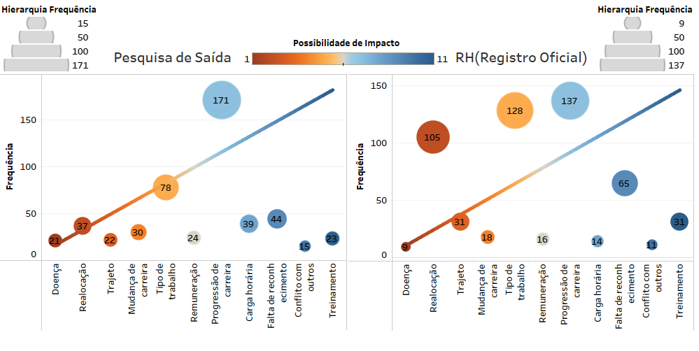

# Relatório

## Resposta 1:

### O gráfico está dividido em duas seções:

**Motivações Internas:**
- Treinamento: Falta de oportunidades de desenvolvimento e treinamento.
- Conflito com outros: Desavenças com colegas ou superiores.
- Falta de reconhecimento: Sensação de que o trabalho não é valorizado.
- Carga horária: Excesso de horas de trabalho ou falta de flexibilidade.
- Progressão de carreira: Ausência de oportunidades de crescimento profissional.
- Remuneração: Salário insatisfatório ou benefícios incompletos.

**Motivações Externas:**
- Tipo de trabalho: Funções que não se encaixam com as habilidades ou interesses do colaborador.
- Mudança de carreira: Desejo de explorar novas áreas profissionais.
- Trajeto: Dificuldade com o deslocamento até o trabalho.
- Realocação: Mudança de cidade ou país por motivos pessoais.
- Doença: Incapacidade de continuar trabalhando por motivos de saúde.

## Resposta 2

**1. Motivações Internas Preponderam:**

- O gráfico indica que as motivações internas são os principais fatores que levam os funcionários a deixarem a empresa. Isso significa que podemos melhorar a retenção de talentos investindo em treinamento, reconhecimento, flexibilidade de trabalho e oportunidades de crescimento profissional.

**2. Remuneração é um Fator Importante:**

- A remuneração também é um fator importante, especialmente quando combinada com outros fatores de insatisfação. É importante revisar a política salarial e de benefícios para garantir que estão oferecendo um pacote competitivo.

## Resposta 3

**1. Legibilidade:**

- Aumentar o tamanho da fonte e espaçamento entre os elementos do gráfico.
  Usar cores mais contrastantes para facilitar a leitura.

**2. Clareza:**

- Adicionar um título mais descritivo ao gráfico.

**3. Foco:**

- Criar gráficos separados para motivações internas e externas.
  Mostrar a porcentagem de cada motivo em relação ao total de desligamentos.

## Resposta 4

### Grafico 1: Comparação entre Pesquisa de Saída e RH

**Insights do Gráfico:**

- Motivações Internas: As motivações internas (treinamento, reconhecimento, carga horária, etc.) são os principais fatores que levam os funcionários a deixarem a empresa.
- Remuneração: A remuneração é um fator importante, especialmente quando combinada com outros fatores de insatisfação.

**Vantagens do Gráfico de Barras:**

- Comparação Eficaz: Facilita a comparação de valores entre diferentes categorias, permitindo identificar diferenças e tendências com clareza.
- Simplicidade: O formato intuitivo é facilmente compreendido por públicos diversos, mesmo sem conhecimento em estatística.
- Versatilidade: Pode ser usado para representar diversos tipos de dados, como quantitativos discretos ou contínuos, e categorias qualitativas.

**Desvantagens do Gráfico de Barras:**

- Limitação de Variáveis: Dificulta a visualização de dados com muitas variáveis, tornando o gráfico complexo e difícil de interpretar.
- Distorção de Escala: A manipulação da escala dos eixos pode distorcer a percepção das diferenças reais entre os dados.
- Dificuldade de Visualização Detalhes: Em casos com muitas categorias, a visualização de detalhes e valores específicos pode ser dificultada.
****
### Gráfico 2: Top 5 setores com maior frequência de desligamento

**Insights do Gráfico:**

- Entre as motivações internas, a falta de oportunidades de progressão na carreira se destaca como a principal causa de desligamento, seguida pela falta de reconhecimento e carga horária excessiva.
- O tipo de trabalho também é um fator relevante, especialmente quando não se encaixa nas habilidades ou interesses do colaborador.

**Vantagens do Gráfico Treemap:**

- Visualização Hierárquica: Permite visualizar facilmente a estrutura hierárquica dos dados, com diferentes níveis de detalhamento.
- Eficiência de Espaço: Ocupa pouco espaço na tela e permite visualizar grandes conjuntos de dados de forma compacta.
- Comparação Intuitiva: Facilita a comparação de valores entre diferentes categorias e subcategorias, mostrando a relação entre as partes e o todo.
- Identificação de Padrões: Permite identificar padrões e tendências nos dados que podem ser ocultados em outros tipos de gráficos.

**Desvantagens do Gráfico Treemap:**

- Dificuldade de Leitura: Em casos com muitos níveis hierárquicos ou subcategorias, o gráfico pode se tornar difícil de ler e interpretar.
- Distorção Perceptiva: O tamanho das áreas pode distorcer a percepção das proporções reais, especialmente quando as áreas são muito pequenas ou semelhantes em tamanho.
- Sensibilidade à Ordem dos Dados: A ordem em que os dados são apresentados pode influenciar a percepção das informações.
- Dificuldade de Comparação Precisa: Dificulta a comparação precisa de valores absolutos, pois a área das áreas não é proporcional aos valores reais.
****
### Gráfico 3: Correlação entre frequência e possibilidade da saída impactar a empresa

**Insights do Gráfico:**

- É necessário investir em ações que visem melhorar o reconhecimento, oportunidades de progressão na carreira, carga horária e remuneração dos funcionários.
- A empresa também deve se preocupar em oferecer trabalhos que se encaixem nas habilidades e interesses dos colaboradores.

**Vantagens do Gráfico de Dispersão:**

- Visualização de Correlação: Permite visualizar a relação entre duas variáveis, mostrando se existe uma correlação positiva, negativa ou inexistente.
- Identificação de Tendências: Útil para identificar tendências e padrões nos dados, como a relação entre o tempo de estudo e o desempenho em um exame.
- Detecção de Outliers: Facilita a detecção de outliers, que são pontos que se desviam significativamente da tendência geral dos dados.

**Desvantagens do Gráfico de Dispersão:**

- Dificuldade de Interpretação: Em alguns casos, pode ser difícil interpretar a relação entre as variáveis, especialmente quando há muitos pontos no gráfico.
- Influência da Escala: A escala dos eixos pode influenciar a percepção da correlação entre as variáveis.
- Sensibilidade à Distribuição dos Dados: A distribuição dos dados pode influenciar a forma da nuvem de pontos, dificultando a identificação da relação entre as variáveis.

## Resposta 5

**O Gráfico de dispersão:**

- **Representa melhor a correlação entre os motivos de saída da empresa. Além disso, fornece também a frequência para cada campo, possibilitando identificar os setores onde mais ocorre a saída de pessoas da empresa. Ao mesmo tempo, permite identificar com base na capacidade de impacto o que deve ser tratado com mais prioridade, a fim de tomar as melhores decisões para solucionar o problema.**
